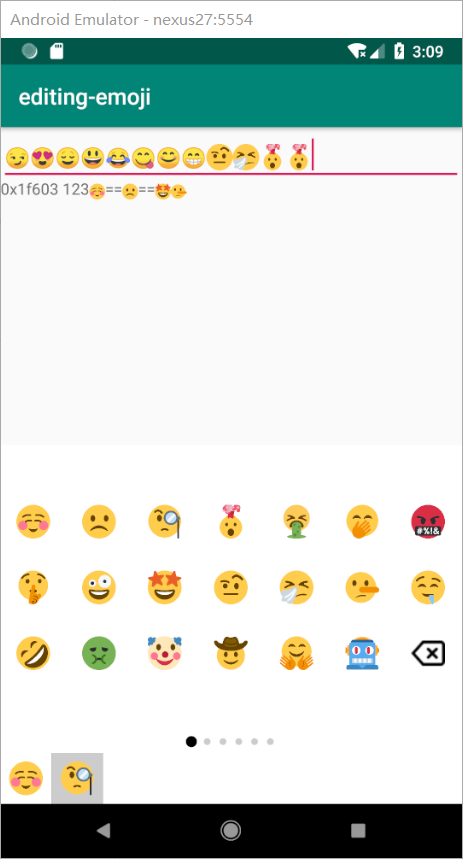

# emoji-panel

[](https://jitpack.io/#xieyangxuejun/emoji-panel)

表情面板

# show shortcut




# Usage

Gradle

```
allprojects {
  repositories {
  ...
  maven { url 'https://jitpack.io' }
  }
}
```

step2

```
dependencies {
	implementation 'com.github.xieyangxuejun:emoji-panel:0.0.1-alpha'
}
```

# About me

I was been Junior Chemist after graduation from college, working in pharmaceutical company.Now, I has been a Android developer, I love google, I love chemistry and programming. You have a idea or wanna be friend with me.**Please contacts my email **: [xieyangxuejun@gmail.com](mailto:xieyangxuejun@gmail.com).